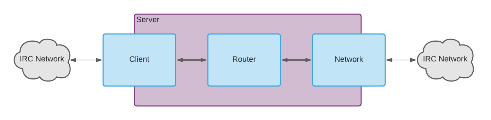

# Architecture

Carousel is made up of several core components

### Server

The server is the central actor. It hosts the IRC proxy, connects to the network, authenticates users, etc.

When it spins up, the server creates a new `Listener` and accepts new `Client` connections. When a new connection is accepted, the server...
1. Listens for incoming messages
2. Starts sending heartbeats
3. Blocks until the user authorizes with the `Registrar`

Once authenticated, the server...
1. Connects to either the specified or default network and listens for messages asynchronously
2. Creates and attaches the client to a new `Router`

### Client and Network

The client and network manage connections and communications. The server buffers message sent from either end and forwards messages via the `Router`.

Both have their own set of hooks which responds to various message commands and optionally forward them on.

### Router

The router listens to the client and network buffers and sends messages to each other. It holds messages for the client when it's detached.

  

